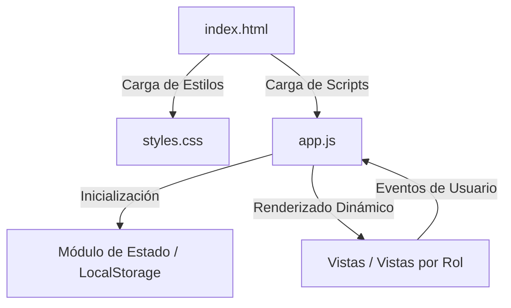

# 🏗️ Arquitectura del Sistema - Intranet Escolar

Este documento describe la estructura organizativa, el flujo de ejecución entre archivos y las decisiones de diseño adoptadas para la solución **Intranet Escolar**.

---

## 📂 1. Estructura del Proyecto

El proyecto sigue una organización limpia y minimalista orientada a componentes web estándar sin capas complejas de compilación:

```text
Intranet-Escolar/
│
├── docs/                      # Documentación técnica del proyecto
│   ├── arquitectura.md        # Especificación de arquitectura y decisiones de diseño
│   └── requerimientos.md      # Catálogo de requerimientos funcionales y no funcionales
│
├── index.html                 # Punto de entrada HTML5 y estructura contenedora de la SPA
├── styles.css                 # Sistema de diseño, variables CSS y estilos adaptativos
├── app.js                     # Lógica JavaScript (enrutamiento, estado y controladores)
│
├── README.md                  # Portada y guía rápida del proyecto
├── CLAUDE.md                  # Memoria y directrices para agentes IA
├── CONTRIBUTING.md            # Guía de contribución y flujo de trabajo Git
└── CHANGELOG.md               # Historial de cambios por versión
```

---

## 🔄 2. Flujo de Archivos e Interacción

La interacción entre los componentes web sigue el modelo de una aplicación **Single Page Application (SPA)** nativa desarrollada en Vanilla JS:



### Descripción del Flujo:

1. **`index.html` (Vista Contenedora)**: 
   - Define el esqueleto HTML5 semántico (`<header>`, `<nav>`, `<main id="app">`, `<footer>`).
   - Importa `styles.css` en el `<head>` para evitar destellos visuales sin estilo (FOUC).
   - Incluye `app.js` al final del `<body>` (o mediante el atributo `defer`) para asegurar que la estructura DOM esté disponible al ejecutar la lógica.

2. **`styles.css` (Capa de Presentación)**:
   - Define un sistema de diseño basado en **variables CSS (`:root`)** para colores primarios, secundarios, fuentes, espaciados y sombras.
   - Implementa **Flexbox** y **CSS Grid** para la maquetación de barras laterales, tarjetas de información y tablas de datos.
   - Soporta estilos *responsive* mediante *media queries* para garantizar una óptima experiencia en móviles y escritorios.

3. **`app.js` (Capa de Lógica y Control)**:
   - Actúa como el controlador central de la aplicación.
   - **Manejo de Enrutamiento**: Intercepta eventos de navegación para alternar vistas dinámicamente dentro del contenedor `<main id="app">` sin recargar la página.
   - **Gestión de Estado y Persistencia**: Maneja la información del usuario autenticado y datos simulados (*Mock Data*) utilizando la API de `localStorage`.
   - **Manipulación del DOM**: Renderiza componentes como tablas de notas, listas de asistencia y paneles de métricas según el rol activo.

---

## 💡 3. Decisiones de Diseño del Prototipo

### A. Arquitectura Vanilla Web (Sin Frameworks)
- **Motivación**: Maximizar la velocidad de ejecución, eliminar el overhead de transpiladores (Webpack, Vite, Babel) y permitir que el prototipo pueda ejecutarse de forma inmediata en cualquier navegador simplemente abriendo el archivo `index.html`.
- **Beneficio**: Bajo consumo de memoria, facíl compresión y mantenimiento sencillo.

### B. Patron de Datos Simulados (*Mock Data*) y LocalStorage
- **Motivación**: Permitir pruebas funcionales completas de inicio de sesión, asignación de notas y consulta de materias antes de integrar una base de datos física o servidor backend.
- **Beneficio**: Autonomía total del frontend durante la fase inicial de prototipado.

### C. Sistema de Diseño basado en Variables CSS
- **Motivación**: Facilitar cambios rápidos en la identidad visual (como colores institucionales) y preparar el terreno para soporte futuro de **Modo Oscuro / Modo Claro** mediante la conmutación de atributos en la etiqueta `<html>` o `<body>`.

### D. Escalabilidad Futura hacia Backend
- **Diseño Decoupled**: La lógica de interacción en `app.js` está estructurada en funciones modularizadas (ej. `login()`, `getCalificaciones()`, `guardarAsistencia()`). Cuando se decida integrar un servidor backend (Node.js, Python FastAPI, PHP o Java Spring), estas funciones podrán adaptarse para realizar solicitudes HTTP `fetch()` a una API REST sin necesidad de rehacer la interfaz de usuario.
